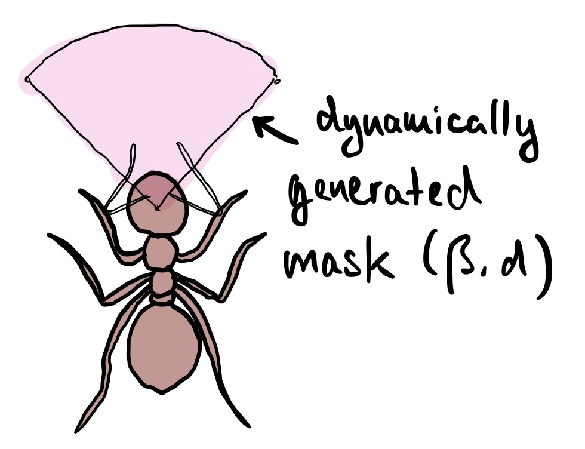
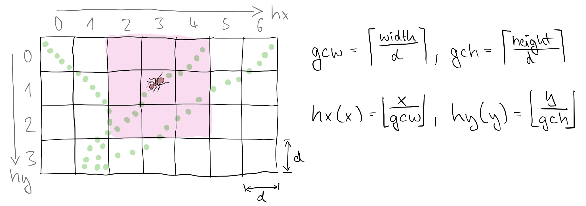

# Ant Colony Simulation
### Optimization ideas

## Angle Updates
It might be a good idea to update the movement angle of the ants not every frame of the animation but rather every x frames. This might allow for smoother animations.

## Pheromone Sensing
To let the ant "sense" the pheromones it is necessary to calculate the distance and angle of all pheromones relative to the ant. To speed up this process it would be good, to limit the number of pheromones to perform this calculation on.

Here are two approaches, that could be tested for efficency:

### Approach 1: Using PyGame Methods

[pygame.sprite.spritecollide](https://www.pygame.org/docs/ref/sprite.html#pygame.sprite.spritecollide) combined with the callables [sprite.collide_circle](https://www.pygame.org/docs/ref/sprite.html#pygame.sprite.collide_circle) or [sprite.collide_mask](https://www.pygame.org/docs/ref/sprite.html#pygame.sprite.collide_mask) could be one approach to narrow down the amount of pheromones that need to be included in the calculations.

If `collide_mask` is used with a dynamically generated mask (`pygame.draw.arc()`) this would return exclusively all the relevant pheromones. As an added bonus it could enhance the simulation by visually showing the sense area of the ants.

This approach should be the preferred one, if there are no performance issues.

### Approach 2: Clustering pheromones in bins

This approach would work with two simple hash functions *(hx(x), hy(y))* to add every pheromone to a bin (2 dimensional array) when created.

When filtering the pheromones the current position of the ant would be hashed to get all (max 9) relevant bins surrounding the ant. 

This could minimize the searchable area to $(d*3)^2 \over (w * h)$. In the case of a 800x600 pixel animation, with a search distance of 10 pixel this would reduce the searchable area to rougly 0,2 % implying a speed boost by factor 500.