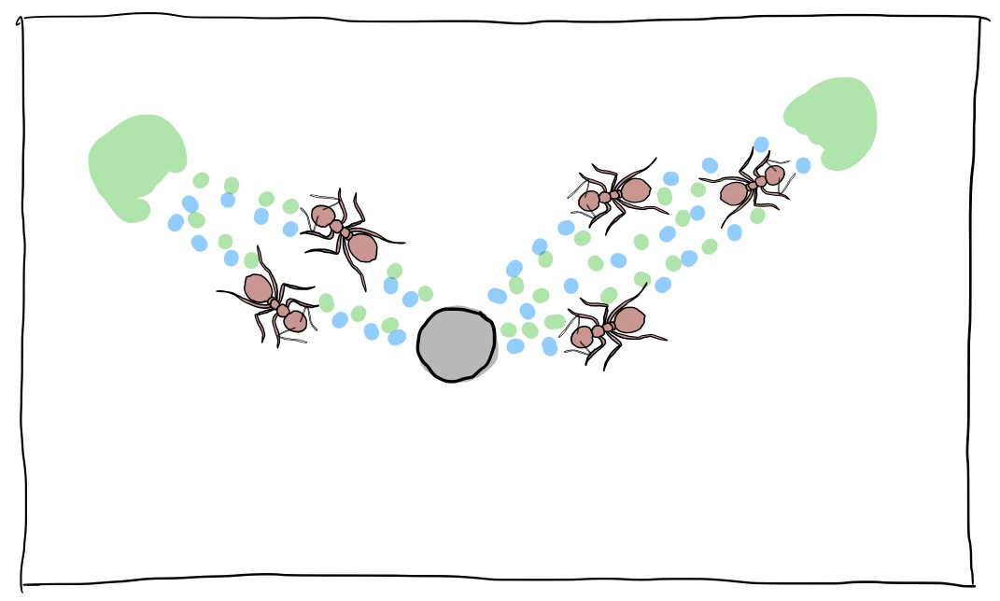
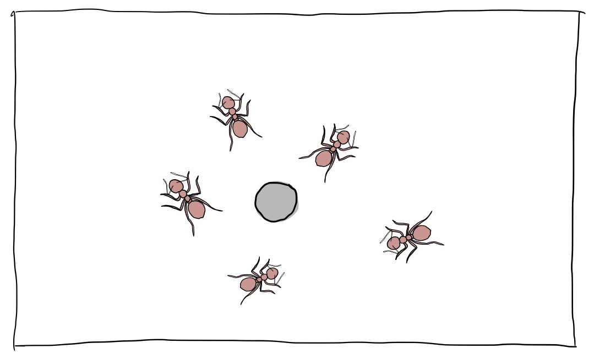
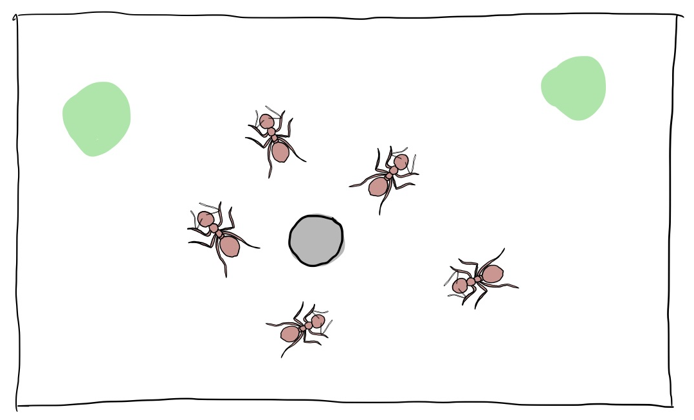
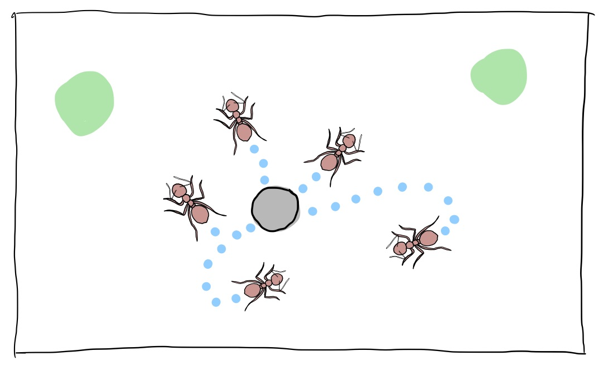
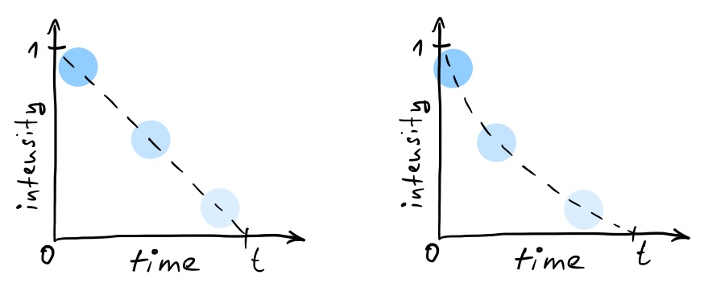
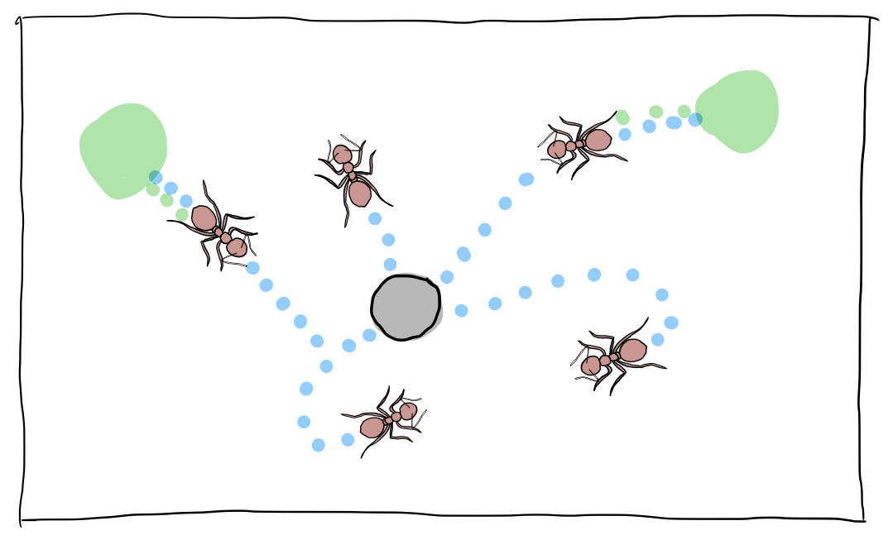
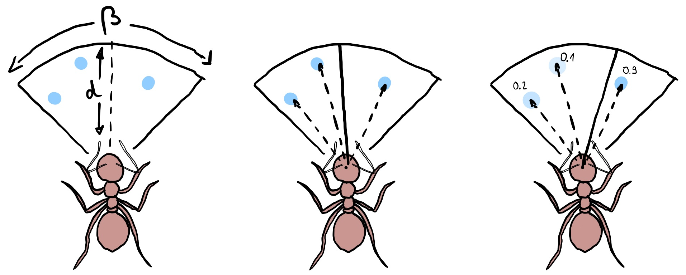
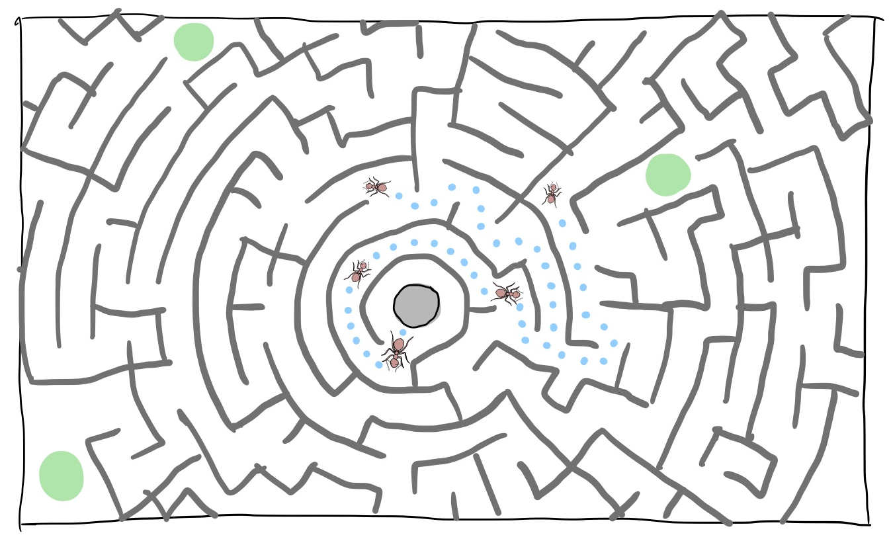

# Ant Colony Simulation
### modeled as a Multi Agent System (MAS)

## Implementation
We plan to implement this simulation in multiple stages. The main stage #1 being the basic goal and the additional stages #2 and #3 as further improvements if everything goes according to plan. Each stage is further broken down into milestones.

### Technical Details
We chose **Python** as Programming language. We think that it's compact code style helps to convey the basic concepts and makes this simulation more accesible to a wider group.
We will use [Pygame](https://www.pygame.org) as graphics library to make our simulations more enticing.

## The Stages

### #1 Main Stage

The overall goal of this stage is to have ants running around on a plane, searching for food and using pheromone trails to efficiently harvest those food sources.

The milestones of this stage are as follows:

### M1: Ants roam the plane

Ants are spawned from their nest (grey hole) and start to roam the plane randomly.

*Parameters:*
- ants spawned per second
- maximum random ant rotation per move

### M2: Food is introduced

Certain spots on the plane can contain clusters of food. Food clusters can be placed randomly or at predefined positions. The latter one is interesting to compare ant efficency with varying parameters. Food clusters have a finite amount of food "atoms". When an ant hits a cluster it will pick up one atom of food, each ant can carry one food atom at a time. When ants hit the nest, they have delivered their food atom and are free to get a new one.

### M3: Ants lay pheromones

Ants will lay two types of pheromones when they move. When they are without food, they will leave a "to home" pheromone trace (blue dots). And when they carry food they will leave a "to food" pheromone trace (green dots).

The pheromone traces will decay over time, by a decay function. This can be linear or exponential.

*Parameters:*
- pheromone decay function

### M4: Ants sense pheromones

The ants get equipped with the ability to sense the pheromones. The pheromones will impact their choice of movement angle. They will follow the "to food" traces (green) when they are not carrying food and use the "to home" traces (blue) when they try to deliver food to the nest.

The ants will have a "field of view" defined by an angle *β*  and a distance *d* in which they will recognize pheromones. The different pheromone vectors will be weighted by current pheromone intensity and an average new movement angle will be calculated.

*Parameters:*
- field of view angle
- field of view distance

### M5: Efficient harvesting

Over time these simple rules should allow the ants to harvest the food sources very efficiently thereby showing the beauty and strength of Multi Agent Systems.

Varying the afore mentioned parameters will allow to simulate different behaviours of the ants.

## #2 Additional Stage: Labyrinth

The first additional stage will be to introduce walls to be able to build labyrinths. This will imply to implement collision detection between ants and walls. As a result the simulations will become even more interesting as the ants will now be able to show their strength in navigating these mazes.

## #3 Additional Stage: Dangers

The idea of this stage is to introduce dangers. This could be tainted food or enemies for example. The ants will use additional kind of pheromones (yellow) to warn other ants or guide warrior ants to engage those enemies.
